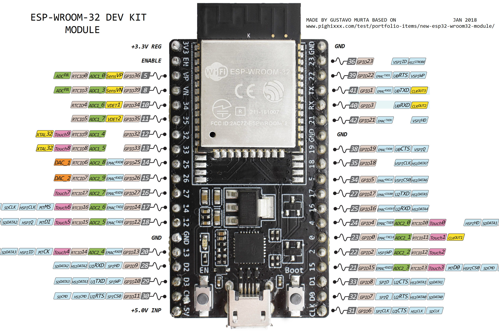

<!-- PROJECT LOGO -->
 

  

  <h3 align="center">It's not rocket science</h3>

  

    Rocket pose, simulations and static fires
     
   
  

<!-- ABOUT THE PROJECT -->
## About The Project

We are trying to fly and tvc control a model rocket. The pose is measured with mpu9250 giro, neo6m gps and bpm280 pressure sensor and all the libraries can be found in `sensor libs`. Mcu of choice for this project is ESP-32, using the onboard long range wifi to communicate and a sd card to use as a black box. The thrust vector control mount `TVC` can be found in `tvc mount` and it holds two 3d print versions from [thingiverse](https://www.thingiverse.com/). The motors that are attached to the mount are simple and small 9g servos which we modified to control it directly with [pid](https://github.com/vasetrendafilov/INRS/tree/main/analogservo). The main problem is to make a strong enough motor because there are none here. I could not make the trust be somewhat linear, the only configuration was exponential burn of the fuel, but it could not be controlled. 

This project consists with allot of simulations:
* [Rcandy motor](https://github.com/vasetrendafilov/INRS/blob/main/simulations/Rcandy_Motors.ipynb) simulation for our custom solid motor with static trust measurements captured with loadcell
* [Rocket py](https://github.com/vasetrendafilov/INRS/blob/main/simulations/sim.ipynb) flight simulation
* [Reading pose data](https://github.com/vasetrendafilov/INRS/blob/main/simulations/reader.ipynb)
* Testing [unscented kalman filter](https://github.com/vasetrendafilov/INRS/blob/main/simulations/ukf.ipynb) on the pose data
* [Xflr5](https://github.com/vasetrendafilov/INRS/tree/main/simulations/xflr5_6.50_win64) aerodynamic simulation for glider performance

## Built With

* [ESP-IDF](https://github.com/espressif/esp-idf)
* [Freertos](https://www.freertos.org/)
* [Rocketpy](https://docs.rocketpy.org/en/latest/)
* [Xflr5](http://www.xflr5.tech/xflr5.htm)
* [Vue](https://vuejs.org/)

## [Static Fire](https://github.com/vasetrendafilov/INRS/tree/main/static_fire)

Web app to assist with rocket motor static tests. Consists of a platform with a loadcell to measure the trust of the motor that is placed on top of it. The ignition is started with a electric spike shorting three 1.5v batteries using a mosfet. Everything is controlled with the website that sends the command to ignite and receives the data from the loadcell real time plotting the trust and save it for further analysis. 

## [Glider](https://github.com/vasetrendafilov/INRS/tree/main/glider)

Full multitasking implementation using multiple tasks on the two cores to record pose with the sensors and save it to sd card. Also implement the filters for the mpu and pid to control the glider. This part of the project is on postpone for now because the gps died.
  
<!-- LICENSE -->
## License

Distributed under the MIT License. See `LICENSE.txt` for more information.

<!-- CONTACT -->
## Contact

Vase Trendafilov - [@TrendafilovVase](https://twitter.com/TrendafilovVase) - [vasetrendafilov@gmail.com](mailto:vasetrendafilov@gmail.com)

Project Link: [https://github.com/vasetrendafilov/INRS](https://github.com/vasetrendafilov/INRS)

(<a href="#top">back to top</a>)

